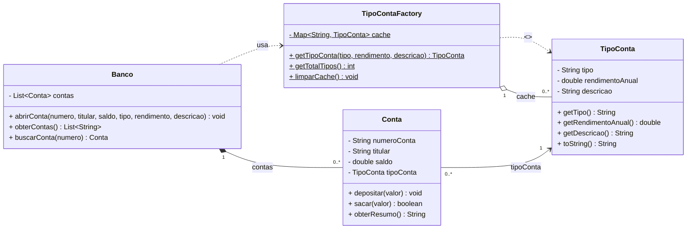

# Banco Flyweight — Padrão de Projeto Flyweight

Exemplo didático do padrão **Flyweight** aplicado a um sistema bancário simples,
desenvolvido com Java 11 e Maven.

---

## Diagrama de Classes (Mermaid)



---

## Estrutura do projeto

```
banco-flyweight/
├── pom.xml
└── src/
    ├── main/java/br/com/banco/flyweight/
    │   ├── TipoConta.java          ← Flyweight (estado intrínseco)
    │   ├── TipoContaFactory.java   ← Fábrica com pool/cache
    │   ├── Conta.java              ← Contexto (estado extrínseco)
    │   └── Banco.java              ← Cliente / unidade de negócio
    └── test/java/br/com/banco/flyweight/
        └── BancoTest.java          ← 8 testes JUnit 5
```

---

## Como executar

```bash
# Compilar e rodar todos os testes
mvn test

# Apenas compilar
mvn compile
```

---

## Sobre o padrão Flyweight

| Conceito | Classe neste projeto |
|---|---|
| **Flyweight** (objeto compartilhado) | `TipoConta` |
| **Flyweight Factory** (pool/cache) | `TipoContaFactory` |
| **Context** (estado extrínseco) | `Conta` |
| **Client** (usa o flyweight) | `Banco` |

### Estado intrínseco × extrínseco

- **Intrínseco** (dentro do Flyweight — imutável, compartilhado):  
  `tipo`, `rendimentoAnual`, `descricao` → ficam em `TipoConta`.

- **Extrínseco** (fora do Flyweight — único por instância):  
  `numeroConta`, `titular`, `saldo` → ficam em `Conta`.

O ganho é que, mesmo com milhares de contas `Corrente`, existe **um único
objeto** `TipoConta("Corrente", ...)` em memória — todas as contas apontam
para ele.
